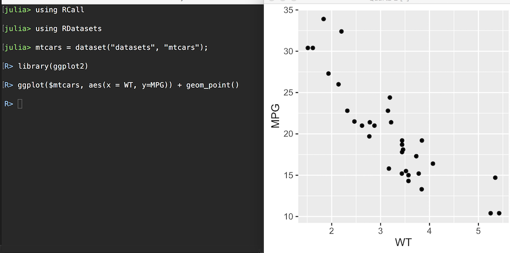

# RCall.jl

R is a language for statistical computing and graphics that has been around for couple of decades and it has one of the most impressive collections of scientific and statistical packages of any environment. Recently, the Julia language has become an attractive alternative because it provides the remarkable performance of a low-level language without sacrificing the readability and ease-of-use of high-level languages. However, Julia still lacks the depth and scale of the R package environment.

This package, RCall.jl, facilitates communication between these two languages and allows the user to call R packages from within Julia, providing the best of both worlds. Additionally, this is a pure Julia package so it is portable and easy to use.

## Installation

See the [Installation](http://juliainterop.github.io/RCall.jl/stable/installation) section of the documentation.

## Getting Started

See the [Getting Started](http://juliainterop.github.io/RCall.jl/stable/gettingstarted) section of the documentation.

# ggplot2 demonstration

# Calling Julia from R

See the JuliaCall library to [call Julia from R](https://non-contradiction.github.io/JuliaCall//index.html).
